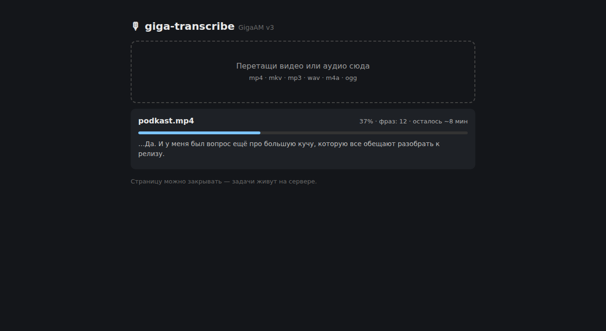

# giga-transcribe

Кинул видео или аудио — получил текст и субтитры. Русский ASR [GigaAM v3](https://github.com/salute-developers/GigaAM), работает локально, без облака и подписок.



Что умеет:
- файлы любой длины — хоть часовые лекции и подкасты (нарезка на фразы через Silero VAD)
- текст + субтитры `.srt` / `.vtt` с таймингами
- текст сразу с пунктуацией и заглавными буквами — чистить и нормализовать не надо
- OpenAI-совместимый endpoint — можно подменить `api.openai.com` своим сервером
- веб-морда: перетащил файл, видишь прогресс с примерным временем до конца, страницу можно закрывать — задача досчитается на сервере

## Установка

```bash
git clone https://github.com/EvgeniiDev/giga-transcribe && cd giga-transcribe
git clone --depth 1 https://github.com/salute-developers/GigaAM
pip install -r requirements.txt && pip install -e ./GigaAM  # веса ~1GB докачаются сами
uvicorn src.app:app --port 8099  # → http://localhost:8099
```

Или в Docker (веса ~422MB уже внутри образа):

```bash
docker compose up --build -d
```

## API

```bash
# Async — для файлов любой длины:
curl -F f=@lecture.mp4 http://localhost:8099/upload      # -> {"id": ...}
curl http://localhost:8099/jobs/<id>                     # poll: status/progress/preview
curl http://localhost:8099/jobs/<id>/text                # готовый текст (/srt, /vtt — субтитры)

# Sync, OpenAI-совместимый — для коротких файлов:
curl -F file=@a.mp3 -F model=gigaam-v3 http://localhost:8099/v1/audio/transcriptions
# response_format: json | text | verbose_json | srt | vtt
```

## Ссылка (audio-video-to-text)

В audio-video-to-text можно вставить ссылку на видео вместо загрузки файла: вставь URL в поле на главной, сервер скачает видео через yt-dlp, прогонит стадии (скачивание → сцены → OCR слайдов → ASR → transcript.md), а на выходе получишь `transcript.md` и слайды с распознанным текстом — всё в папке задачи.

```bash
curl -X POST http://localhost:8099/fetch -H 'Content-Type: application/json' -d '{"url": "https://example.com/video"}'  # -> {"id": ...}
curl http://localhost:8099/jobs/<id>/md   # готовый transcript.md
```

